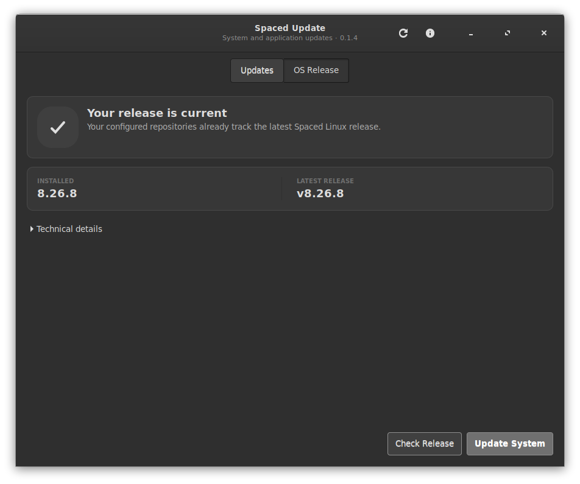

# Spaced Update

The update application for [Spaced Linux](https://spacedlinux.com).

Spaced Update updates Spaced Linux systems through **APT** and **Flathub** in a
single GTK interface. System operations run through a small `pkexec` helper.
Per-user Flatpaks run as the signed-in user, with a live progress and log view.



## What it does today

- **Check for Updates** refreshes APT indexes, then lists available packages
  and Flatpak apps/runtimes in user, system, and named system installations.
  Failed sources remain visible alongside results from healthy sources.
- **Install Selected** applies only the packages/apps you check, using the
  helper's `apt-install` and `flatpak-update` subcommands with per-step
  progress. Multiarch selections retain their architecture. Selected APT
  updates cannot remove packages or silently install unrelated selections.
- Shows a clear overall progress bar and named update stages. The real command
  output remains available in a collapsed, scrollable **Technical details**
  panel when it is useful, without taking over the normal experience.
- Uses one adaptive, theme-aware interface for both light and dark Spaced Linux
  themes, with readable update cards and full-size action targets.
- Runs the privileged steps through the Polkit action
  `com.spacedlinux.update` so the helper is policy-controlled.

## Full OS update

The **OS Release** tab optionally checks the `crhy/spaced` release feed for the newest
Spaced Linux version and compares it against the installed `/etc/os-release`
version. Spaced Linux is a rolling release, so OS updates are applied from the
package repositories via the existing update helper — no ISO download is needed.
**Update System** remains available even when GitHub is unavailable. It applies
APT `dist-upgrade`, refreshes initramfs/GRUB, and updates all Flatpak apps and
runtimes in both the system and signed-in user's installations. Existing
named system installations are included. Other users' private installations
are updated when those users run Spaced Update.

The helper requires successful repository refreshes, waits for APT locks,
retries downloads, and downloads packages before installation. A retry first
completes pending dpkg configuration while preserving locally edited conffiles.
It rejects plans that replace sysvinit or remove core Spaced desktop packages.
It retains old kernels and downloaded packages; it does not run automatic
autoremove/purge. Administrator holds and deferred updates are reported and
never overridden. Authentication cancellation and command failures permit a
retry; the window cannot close or start another operation during an update.

An old installation still needs a working signed Spaced APT source and a
current host helper. The updater cannot deliver packages that the repository
has not published, override local pins, or repair every broken package graph.
The installed release marker advances through the distribution packages,
independently of GitHub's release-feed availability.

## Layout

```
bin/spaced-update                # launcher: runs the GTK app
src/spaced-update.py             # GTK3 UI and worker
src/spaced-update-helper         # privileged bash helper (pkexec)
data/spaced-update.desktop       # desktop entry
data/com.spacedlinux.update.policy  # Polkit policy for the helper
```

## How it is installed on Spaced Linux

- `src/spaced-update.py` -> `/usr/lib/spaced-linux/spaced-update.py`
- `src/spaced-update-helper` -> `/usr/lib/spaced-linux/spaced-update-helper`
- `bin/spaced-update` -> `/usr/local/bin/spaced-update`
- `data/spaced-update.desktop` -> `/usr/share/applications/spaced-update.desktop`
- `data/com.spacedlinux.update.policy` -> `/usr/share/polkit-1/actions/com.spacedlinux.update.policy`

## Flatpak release

Spaced Update is also published as a Flatpak (`org.spacedlinux.SpacedUpdate`)
as an alternate UI package for Spaced Linux systems. Inside the sandbox, APT,
Flatpak, and the pkexec helper are reached through `flatpak-spawn --host`, so
the interface behaves exactly like the system app; privileged work still runs
through the host's Polkit policy. The host must therefore carry Spaced Linux's
`spaced-update-helper` and Polkit action; the Flatpak is not a generic updater
for unrelated distributions.

- **Build**: `bash flatpak/build.sh` — produces a static OSTree repository in
  `flatpak-build/repo` and an updateable release bundle (supported GNOME
  runtime plus bundled Spaced themes so the app matches the desktop on any
  host). Set `SPACED_THEME_SOURCE` to a local Spaced `usr/share/themes` directory
  to use the release's themes; otherwise the build uses a pinned source commit.
- **Publish**: `bash flatpak/publish.sh` — pushes the repository to the
  `gh-pages` branch for serving at `https://crhy.github.io/spacedupdate/flatpak-repo`.
- **Install from the signed Spaced GitHub remote**:
  ```
  flatpak --user remote-add --if-not-exists spaced-github \
      https://crhy.github.io/spacedbazaar/spaced-github.flatpakrepo
  flatpak --user install spaced-github org.spacedlinux.SpacedUpdate
  flatpak run org.spacedlinux.SpacedUpdate
  ```
  The central publication job verifies the GitHub release bundle and exports
  its AppStream metadata and icon into the GPG-signed repository.

On Spaced Linux, the native package remains the primary install; the Flatpak
is the alternate application-delivery path.

## Development checks

Run the deterministic source tests and syntax checks on a Spaced Linux host:

```sh
python3 -m unittest discover -s tests -v
xvfb-run -a python3 -m unittest discover -s tests -v  # includes GTK interaction checks
python3 -m py_compile src/spaced-update.py tests/test_spaced_update.py
bash -n src/spaced-update-helper install.sh flatpak/build.sh flatpak/publish.sh
bash tests/test_publish.sh  # temporary local Git/OSTree repositories only
```

The reliability tests execute a copied helper against fixture commands in a
temporary directory. They do not change the host package database.

## Roadmap

Planned features are tracked as GitHub issues. See the
[issue tracker](https://github.com/crhy/spacedupdate/issues) and the current
[triage notes](ISSUE-TRIAGE.md) for:

- Full integration with Spaced Linux OS updates.
- Peer-to-peer updating and Flatpak distribution.
- Further refinements to the graphical install progress experience.
- Anonymity and privacy protection for shared data.
- Password-protected anonymous file sharing.
- A browsable, rating-driven theme browser.
- App suggestions, ratings, reviews, and metrics as a Bazaar alternative.

## License

MIT — see [LICENSE](LICENSE).
